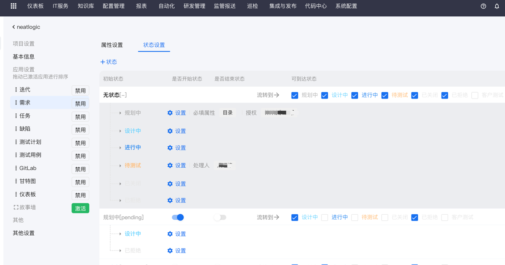
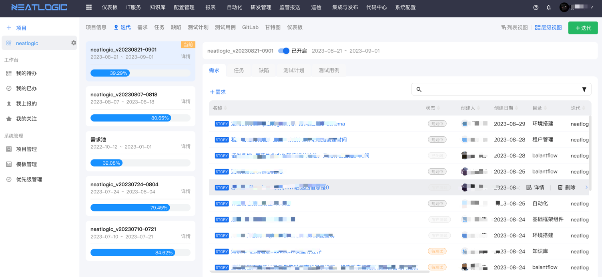
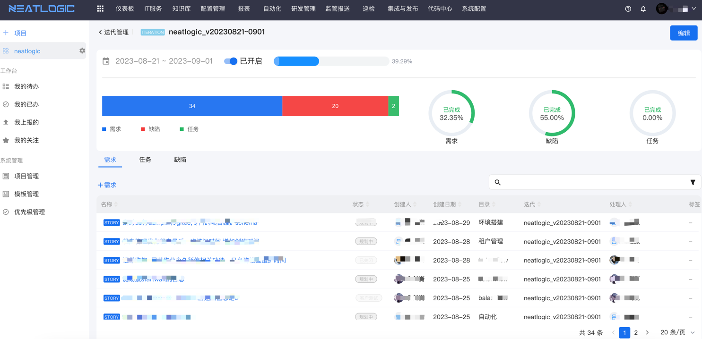
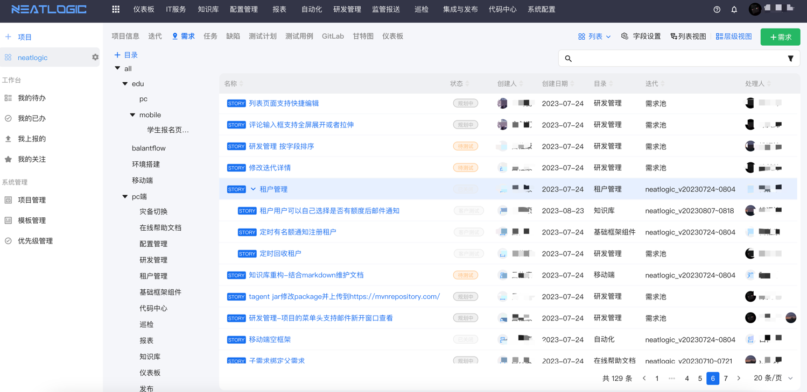
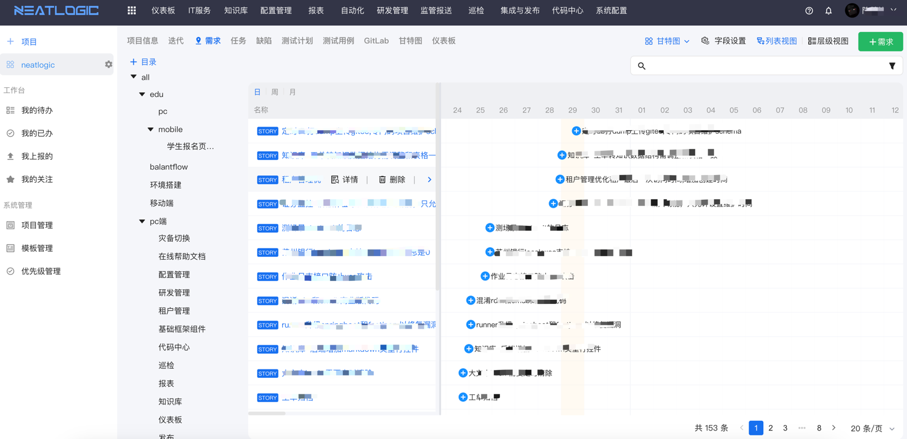
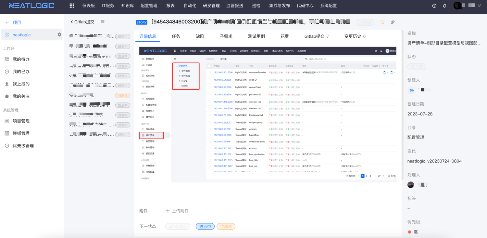

[中文](README.md) / English

---

## About

neatlogic-rdm is an R&D management module equipped with features like requirement management, defect management, test
cases, test plans, and more. It integrates
with [neatlogic-deploy](../../../neatlogic-deploy/blob/develop3.0.0/README.md) and neatlogic-codehub (available in the
commercial version only) to offer full lifecycle management from requirements to code to version releases.

## Features

### Project Management

Start date of the project, project members, project activities  

### App Management

Users can choose to activate different apps based on the nature of the project. The number of app types will
continuously expand with product iterations. The community edition currently supports iterations, requirements, tasks,
and defects as common applications. The commercial version further supports test plans, test cases, GitLab, Gantt
charts, dashboards, and storyboards.  
  

- Customizable attributes.
- Customizable states and state transition controls, including permission control, mandatory attribute control, etc.
- Exclusive configuration pages for different apps.

### Iterations

  

- Apps outside of iterations can be optionally included in the iteration management.

### Requirements

  
  
  

- Unlimited parent-child requirement relationships.
- Custom directories.
- Multiple display views (some views are only available in the commercial version).
- Support for modification history, expenditure records, related code commits, and more.

## Feature List

<table>
    <tr>
        <td>ID</td>
        <td>Category</td>
        <td>Feature</td>
        <td>Description</td>
        <td>Open Source</td>
    </tr>
    <tr>
        <td>1</td>
        <td>System Management</td>
        <td>Project Management</td>
        <td>Manages all projects, including basic information, application settings, and options for ending, deleting, or saving the project as a new template.</td>
        <td>✅</td>
    </tr>
    <tr>
        <td>2</td>
        <td></td>
        <td>Priority Management</td>
        <td>Supports sorting for defining urgency levels of requirements, defects, and tasks.</td>
        <td>✅</td>
    </tr>
    <tr>
        <td>3</td>
        <td></td>
        <td>Template Management</td>
        <td>Allows customizing project templates, application settings including start/stop and sorting, and attributes and status configurations within application settings.</td>
        <td>✅</td>
    </tr>
    <tr>
        <td>4</td>
        <td>Projects</td>
        <td>Dynamic Project Management</td>
        <td>Dynamic settings for application settings, dynamic control over project members.</td>
        <td>✅</td>
    </tr>
    <tr>
        <td>5</td>
        <td></td>
        <td>Iteration Planning</td>
        <td>Includes add, edit, and delete iterations. Supports configuring requirements, tasks, defects, test plans, and test cases in iterations. Allows enabling or disabling iterations.</td>
        <td>✅</td>
    </tr>
    <tr>
        <td>6</td>
        <td></td>
        <td>Manage Requirements, Tasks, Defects, Test Plans, etc.</td>
        <td>Add, edit, and delete common requirements, tasks, defects, test plans, and test cases for the project.</td>
        <td>✅</td>
    </tr>
    <tr>
        <td>7</td>
        <td></td>
        <td>Interlink Data</td>
        <td>Quickly create or link tasks, defects, and test cases in requirement details. Tasks, defects, and test case details can also be linked to requirements.</td>
        <td>✅</td>
    </tr>
    <tr>
        <td>8</td>
        <td></td>
        <td>Test Plan & Test Case Association</td>
        <td>Quickly create or link test cases in test plans and supports batch processing of test cases and tracking completeness.</td>
        <td>❌</td>
    </tr>
    <tr>
        <td>9</td>
        <td></td>
        <td>Workflow Management</td>
        <td>Requirements, tasks, defects, etc. can transition through states and be reassigned until closed.</td>
        <td>✅</td>
    </tr>
    <tr>
        <td>10</td>
        <td></td>
        <td>Gantt Chart Support</td>
        <td>View requirements, defects, and tasks via Gantt chart.</td>
        <td>❌</td>
    </tr>
    <tr>
        <td>11</td>
        <td></td>
        <td>Field Settings for Lists</td>
        <td>All lists support field settings, including changing the order and visibility of fields.</td>
        <td>✅</td>
    </tr>
    <tr>
        <td>12</td>
        <td></td>
        <td>Conditional Filtering for Lists</td>
        <td>Data in lists can be filtered through compound search, including keywords, priority, status, creation date, etc.</td>
        <td>✅</td>
    </tr>
    <tr>
        <td>13</td>
        <td></td>
        <td>View and Edit Data Details</td>
        <td>View detailed information of requirements, tasks, defects, etc. and modify data and linked items in the details page.</td>
        <td>✅</td>
    </tr>
    <tr>
        <td>14</td>
        <td></td>
        <td>Follow Feature</td>
        <td>Follow data from the details page for quick access later.</td>
        <td>✅</td>
    </tr>
    <tr>
        <td>15</td>
        <td></td>
        <td>Code Repository Association, e.g., GitLab, GitHub</td>
        <td></td>
        <td>❌</td>
    </tr>
    <tr>
        <td>16</td>
        <td>Workbench</td>
        <td>My To-Do</td>
        <td>Displays all items where the logged-in user is the handler, including requirements, tasks, defects, test plans, and test cases.</td>
        <td>✅</td>
    </tr>
    <tr>
        <td>17</td>
        <td></td>
        <td>My Completed</td>
        <td>Displays all items the logged-in user has handled, including requirements, tasks, defects, test plans, and test cases.</td>
        <td>✅</td>
    </tr>
    <tr>
        <td>18</td>
        <td></td>
        <td>My Reported</td>
        <td>Displays all items where the logged-in user is the creator, including requirements, tasks, defects, test plans, and test cases.</td>
        <td>✅</td>
    </tr>
    <tr>
        <td>19</td>
        <td></td>
        <td>My Followed</td>
        <td>Displays all items the logged-in user is following, including requirements, tasks, defects, test plans, and test cases.</td>
        <td>✅</td>
    </tr>
    <tr>
        <td>20</td>
        <td>Dashboard</td>
        <td>Data Dashboard</td>
        <td>Displays project-related data through charts.</td>
        <td>❌</td>
    </tr>
</table>